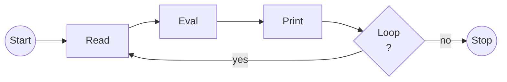

---
jupyter:
  jupytext:
    text_representation:
      extension: .md
      format_name: markdown
      format_version: '1.3'
      jupytext_version: 1.18.1
  kernelspec:
    display_name: Python 3 (ipykernel)
    language: python
    name: python3
---

<!-- #region editable=true slideshow={"slide_type": ""} -->
---
short_title: REPL
numbering:
    heading_1: true
    heading_2: true
    title: true
---

# Die Read-Eval-Print-Loop (REPL)

Im Kapitel zur Installation haben Sie einmal `python3 --version` im Terminal
ausgeführt um sicherzustellen, dass Sie ein aktuelles und funktionierendes
Python installiert haben. Nun machen Sie die ersten Schritte mit Python Code.

## Starten der Python REPL

:::::{margin}
::::{seealso} Terminal-Nutzung
Im gesamten Kurs werden Eingaben im Terminal wie folgt dargestellt:
:::console
$ echo "Hallo Welt"
Hallo Welt
:::
Dabei beginnen Zeilen mit einem Terminal-Befehl mit `$ ` und darauffolgende
Zeilen bis zum nächsten `$ ` die Ausgabe des Befehls. Wenn Sie die Schritte
nachvollziehen, geben Sie den Befehl selbst ein und 'starten' diesen mit
{kbd}`Enter`.

Es werden nicht alle Ausgaben (vollständig) dargestellt.

Achten Sie darauf, dass Sie ggf. Dateipfade anpassen müssen. Mehr dazu im
[Exkurs: Unix](/030-Exkurs_Unix/Einleitung.md).
::::
:::::

Führen Sie das Programm `python3` im Terminal aus, so startet es in die REPL.

```console
$ python3
Python 3.13.7 (main, Aug 14 2025, 11:12:11) [Clang 17.0.0 (clang-1700.0.13.3)] on darwin
Type "help", "copyright", "credits" or "license" for more information.
>>>
```

Um die REPL zu verlassen, tippen Sie `quit()` oder nutzen Sie (in
Unix-basierten Betriebssysteme) die Tastekombination {kbd}`Strg`+{kbd}`D`.

## Ihr erstes Python

Die REPL verhält sich ähnlich zum Terminal, nur dass nicht Befehle nach
(typischerweise) einem "`$ `" eingegeben werden, sondern dass Python-Code nach
einem "`>>> `" eingegeben wird.

Nachfolgend finden Sie ein paar Beispiele. Probieren Sie diese selbst aus und
ändern Sie sie dann ab.

```python-repl
>>> 2+2
4
```

```python-repl
>>> "Hallo, Welt!"
'Hallo, Welt!"
```

```python-repl
>>> print("Hallo, Welt!")
Hallo, Welt!
```

Ist der Python-Code noch nicht vollständig, so verändert sich der Prompt zu `... `.

```python-repl
>>> print(
...
... "Hallo"
... )
Hallo
```

## Die Struktur einer REPL

Eine REPL (siehe {numref}`fig:repl`) ist ein Programm, welches:

1. _**R**ead_: Einen Befehl oder hier ein Stück Python-Code einliest.
2. _**E**val_: Dann den Code ausführt.
3. _**P**rint_: Das Ergebnis des ausgeführten Codes zurück gibt.
4. _**L**oop_: Und das solange wiederholt, bis es beendet wird (bei Python via
   `quit()`).

<!-- #endregion -->

<!-- #region editable=true slideshow={"slide_type": ""} -->
::::{figure}
:name: fig:repl


Zustandsdiagramm der Bestandteile einer REPL
::::
<!-- #endregion -->

<!-- #region editable=true slideshow={"slide_type": ""} -->
Betrachten wir den Ablauf folgendes Szenarios:

1. Sie starten den Python-Interpreter mit
   ```bash
   $ python3
   ```
2. Python startet, gibt die Versionsinformationen aus und zeigt Ihnen mit dem
   Prompt `>>> ` an, dass es zum Einlesen eines Python-Ausdrucks bereit ist.
   
   Die REPL ist nun im Zustand _Read_.
3. Sie können nun einen Python-Ausdruck eingeben. Dieser kann `print("Hallo")` sein oder aber auch
   ```
   >>> print(
   ...   "Hallo"
   ... )
   ```
   
   Während Sie den Ausdruck eingeben bleibt die REPL im Status _Read_. Haben
   Sie einen vollständigen Ausdruck eingegeben (Wann ein Ausdruck "vollständig"
   ist lernen Sie später.) und drücken Sie dann die Eingabetaste, so wechselt
   die REPL in den Zustand _Eval_.
4. Bei der Evaluation des Python-Ausdrucks versucht der Interpreter, den Code
   auszuführen. Ist er korrekt (und bezieht sich nur auf Namen(/Variablen), die
   bereits definiert wurden), so wird der Code ausgeführt. Nachdem der Code
   ausgeführt wurde wechselt die REPL in den Zustand _Print_ und es wird das
   **Ergebnis** des gerade ausgeführten Python-Codes gedruckt.
5. Dann wird in den Zustand _Loop_ gewechselt und überprüft, ob eine
   Abbruchbedingung erreicht wurde. Ist dies nicht der Fall – soll also wieder
   von Anfang begonnen werden so wechselt die REPL zurück in den Zustand _Read_
   und der Ablauf springt damit zu Schritt 2. Soll die Schleife nicht fortgesetzt
   werden, so geht die REPL über in den Zustand _Stop_ und der Python-Interpreter
   wird beendet.
<!-- #endregion -->

<!-- #region editable=true slideshow={"slide_type": ""} -->
## Lernstandskontrolle
<!-- #endregion -->

**Nachvollziehen der Zustände der REPL**
::::{admonition} 💪 Übung
:icon: false

Nachvollziehen Sie die nachfolgende REPL-Interaktion. Was sind Ausgaben per
`print` und was sind Ausgaben durch den Zustand _Print_ der REPL?

```python-repl
>>> hallo = "Hallo Python-Lernende"      # 1
>>> hallo                                # 2
'Hallo Python-Lernende'                  # 3
>>> print(hallo)                         # 4
Hallo Python-Lernende                    # 5
>>> print("Hallo Python-Lernende")       # 6
Hallo Python-Lernende                    # 7
>>> 
```

:::{dropdown} ✅ Lösung

_**zu 1:**_ Hier wird eine Variable mit dem Namen `hallo` erzeugt in der das
String-Literal `"Hallo Python-Lernende"` gespeichert wird. Dieser Ausdruck hat
kein Ergebnis, weshalb nach der Zeile sofort der Prompt für die nächste Eingabe
angezeigt wird.

_**zu 2:**_ Hier besteht der Python-Ausdruck nur aus der Variablen mit dem
Namen `hallo`. Eine Variable hat ihren Wert als Ergebnis, weshalb im Zustand
_Print_ der REPL das String-Literat `'Hallo Python-Lernende'` ausgegeben wird
(siehe _**3**_).

Beachten Sie, dass in Python Strings entweder mit `'` oder mit `"` umschlossen
werden können. Sie sind gleichwertig und die Verwendung ist nur relevant, wenn
der String selbst ein `'` oder ein `"` enthält. Der String `"Wie geht's?"`
müssten mit einfachen Anführungszeichen mit Hilfe eines sog. Escape-Zeichens
geschrieben werden: `'Wie geht\'s?'`. Anders herum wäre es bei diesem String:
`"Sie sagte: \"Hallo.\""` bzw. `'Sie sagte: "Hallo."'`.

_**zu 4:**_ Hier wird die Funktion `print()` genutzt um den Wert der Variablen
`hallo` zu drucken. Dies geschieht im Zustand _Eval_ und die Ausgabe dazu ist
in _**5**_ zu sehen. Die Funktion `print()` hat selbst kein Ergebnis, weshalb
nichts zusätzliches durch den Zustand _Print_ ausgegeben wird.

_**zu 6:**_ In diesem Schritt wird wie beim ersten Beispiel die Funktion
`print()` mit einem String-Literal genutzt. Die Ausgabe in _**7**_ ist von der
Version, die die Variable `hallo` nutzt nicht zu unterscheiden.

::: 

:::: 


:::{hint} Kommentare in Python-Code

Die Zahlen am Ende eines Ausdrucks (bspw. `# 1`) sind ein Kommentar, um in der
Musterlösung einzelne Zeilen referenzieren zu können.

In Python beginnen Kommentare mit einem `#` und es wir alles bis zum Zeilenende
vom Interpreter ignoriert. Kommentare sind für Menschen, die den Code lesen
gedacht und nicht für den Computer.

::: 


**Nutzung der REPL**

```python editable=true slideshow={"slide_type": ""} tags=["remove-cell"]
from jupyterquiz import display_quiz
c = { '--jq-multiple-choice-bg': '#202080',
      '--jq-mc-button-bg': '#fafafa',
      '--jq-mc-button-border': '#e0e0e0e0',
      '--jq-mc-button-inset-shadow': '#555555',
      '--jq-many-choice-bg': '#202080',
      '--jq-numeric-bg': '#202080',
      '--jq-numeric-input-bg': '#c0c0c0',
      '--jq-numeric-input-label': '#101010',
      '--jq-numeric-input-shadow': '#999999',
      '--jq-string-bg': '#202080',
      '--jq-incorrect-color': '#c80202',
      '--jq-correct-color': '#009113',
      '--jq-text-color': '#fafafa',
      '--jq-link-color': '#9abafa' }
```

```python editable=true slideshow={"slide_type": ""} tags=["remove-input"]
q = [{
        "question": "Welche Ausgabe erhalten Sie, wenn Sie <pre>>>> 3**3</pre> in die REPL eingeben?",
        "type": "multiple_choice",
        "answers": [
            { "code": "3**3", "correct": False },
            { "code": "27", "correct": True },
            { "code": "6", "correct": False },
            { "code": "33", "correct": False },
            { "code": "333", "correct": False },
            { "code": "SyntaxError", "correct": False }
        ]
    },
    {
        "question": "Wie können Sie eine Kommazahl in Python eingeben?<br>Probieren Sie auch die falschen Optionen aus. Was ist deren Ergebnis?",
        "type": "multiple_choice",
        "answers": [
            { "code": "12,34", "correct": False },
            { "code": "12.34", "correct": True },
            { "code": "1234e-2", "correct": True },
            { "code": "123,4e-1", "correct": False },
        ]
    },
    {
        "question": "Welche Ausgabe ergibt die folgende Eingabe in die REPL? Geben die Ausgabe bis zum ersten Leerzeichen ein.<pre>>>> test</pre>",
        "type": "string",
        "answers": [
            { "answer": "NameError:", "correct": True,
              "match_case": False, "fuzzy_threshold": 0.9,
              "feedback": "Korrekt. Wie in der Fehlermeldung angegeben ist die Variable `test` nicht definiert, weshalb Sie deren Wert nicht auslesen können."},
            { "answer": "Traceback", "correct": True,
              "match_case": False, "fuzzy_threshold": 0.9,
              "feedback": "Korrekt. Sie sehen einen sog. Traceback, welcher es bei komplizierteren Fehlern ermöglicht die ursprüngliche Fehlermeldung zu finden. Der Fehler 'NameError' sagt, dass der Name `test` bisher nicht als Variable, Funktionsname, … definiert wurde."},
        ]
    }]
display_quiz(q, colors=c)
```
